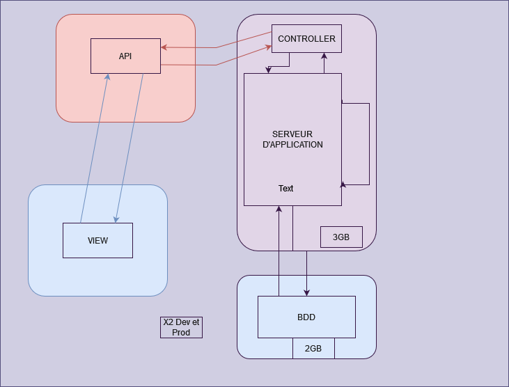
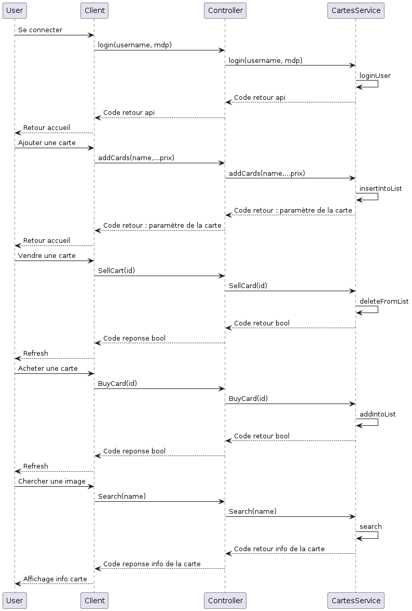

# ASI---WebDynamique---Microservices

Anaïs Delcamp 

Eléa Machillot 

David Jeannin 

Tristant Bellat 

Git : https://github.com/bellat-tristan/ASI---WebDynamique---Microservices 

## Atelier 2
1. Bilan de réalisation de l'application 

    Tout les éléments du cahier des charges ont été réalisé. Il est possible de créer un compte sur l'application, de se connecter. On a la génération de cartes aléatoire (starter) dès l'inscription. Il y a la possibilité de mettre en vente ses cartes (l'utilisateur aura l'argent dès que quelqu'un l'achetera) et d'acheter des cartes. 

2. Tableau comparatif des architectures logicielles possibles (MVC, SOA, Microservices)

    | | MVC | SOA | Microservices |
    | :--------------- | :--------------- |:---------------:|:---------------:|
    | Avantages | Séparation | Réutilisation des services | Evolutivité |
    | | Performance | Interopérabilité | Bonne tolérences aux pannes |
    | | Communication interne | Maintenance | Très bonne évolutivité |
    | Inconvénients | Complexe à maintenir | Gestion service complexe | Utilisation élevé de la mémoire |
    | | Performances | Interdependances | Latences réseau | 
    | Cas d'utilisation | App web avec inerface riche | Grandes entreprises | Grandes entreprise avec haute dispo |
    | Interopérabilité | Même application | Bien | Excellente |
    | Gestion | Centralisée | Distribuée | Très distribuée |

3. Architecture système 

      

4. Diagramme des classes 

     

5. Diagramme représentant les workflows 

    