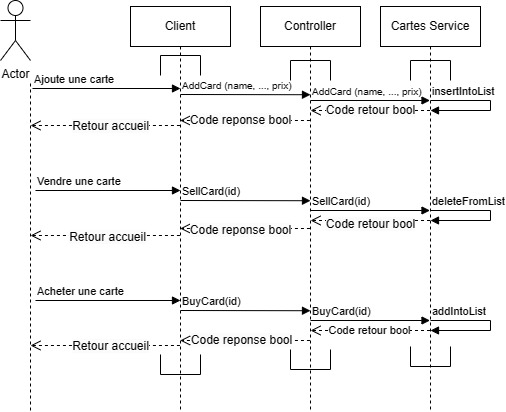
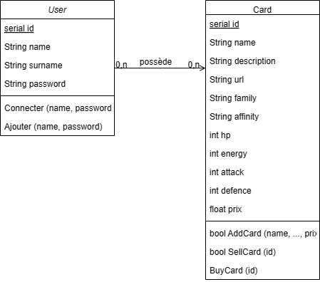

# ASI---WebDynamique---Microservices

Anaïs Delcamp 

Eléa Machillot 

David Jeannin 

Tristant Bellat 

Git : https://github.com/bellat-tristan/ASI---WebDynamique---Microservices 

Tout les éléments du cahier des charges ont été réalisés. 

## Atelier 1 

**Architecture statique :**

**Architecture dynamique :** 

---

**Diagramme de séquence :** 

**Diagramme de classe :** 

---

**Questions**
 
---

* En quoi vos prototypes respectent le pattern MVC  
1. Partie Modèle : logique métier. Ici on y définie notre classe Card et on utilise bien un DTO. Ainsi on respecte le pattern MVC.

2. Vue : Affichage. Dans notre dossier ressourceS.templates nous avons toutes nos pages HTML qui ne concentre aucune logique métier et permettent simplement l'affichage des pages.

3. Controlleur : Echanges. Nous avons ici dans notre dossier controlleur qui permet d'effectuer des acvtions en fonction des requetes de l'utilisateur.

    Notre architecture respecte bien le pattern MVC.

 
 ---
* Avantages et inconvénients 

|| Web Statique + Web Service | Dynamique |
| :--------------- |:---------------:|:---------------:|
| Avantages |   Meilleur optimisation | Meilleure experience utilisateur |
| |   Moins de ressource serveur | Mise a jour très simple |
| |   Bon marché | Nouvelles fonctionnalitées simple |
| |   Facile d'implémentation pour des sites simples | Developpement plus rapide avec les framework |
| |   Réutilisation du code | Personnalisation simplifié |
| Inconvénients | Complexe a maintenir à jour | Couts |
| | Ajout de fonctionnalitées contraignant | Plus difficile a sécuriser |
| | Surcharge de développement | Installation plus complexe |
